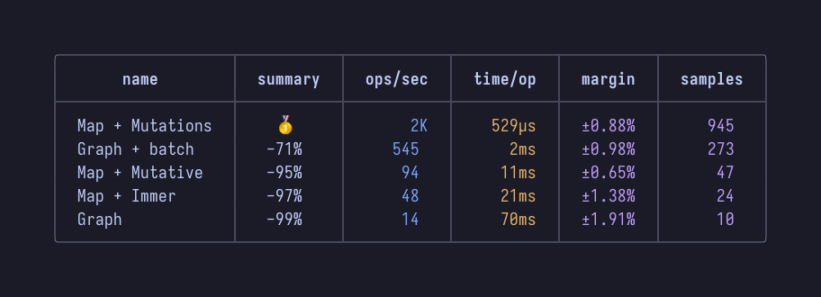

<div align="center">

<h1>tinybench-pretty-printer</h1>

**🔎 Customizable pretty-printer for [tinybench](https://github.com/tinylibs/tinybench) benchmarks**


</div>



# Features

- Output for CLIs and markdown
- Build your own columns
- Change column order
- Handles unicode & truncation
- Customizable count formatting:
    - `none`
    - `shortest`
    - `highest`
    - `lowest`
    - `mean`
    - `thousands`
    - `millions`
    - `billions`
- Customizable duration formatting:
    - `shortest`
    - `highest`
    - `lowest`
    - `mean`
    - `nanoseconds`
    - `microseconds`
    - `milliseconds`
    - `seconds`
- Sorting:
    - `false`
    - `asc`
    - `desc`
    - `Function`
- Uses `Intl.NumberFormat` for localization and removing insignificant fractions
- Customizable header titles, styles and alignments
- Customizable row styles and alignments
- Customizable borders and border styles
- …

# Installation

```sh
npm install @monstermann/tinybench-pretty-printer
yarn add @monstermann/tinybench-pretty-printer
pnpm add @monstermann/tinybench-pretty-printer
```

# Getting Started

```ts
import { Bench } from "tinybench";

const bench = new Bench();

bench.add(Function);
bench.add(Function);
bench.add(Function);

await bench.run();
```

**Using Defaults**

```ts
import { tinybenchPrinter } from "@monstermann/tinybench-pretty-printer";

const cli = tinybenchPrinter.toCli(bench);
console.log(cli);
```

```ts
import { writeFile } from "node:fs/promises";

const markdown = tinybenchPrinter.toMarkdown(bench);
await writeFile("results.md", markdown);
```

**Using Options**

```ts
import { tinybenchPrinter } from "@monstermann/tinybench-pretty-printer";

const myCustomPrinter = tinybenchPrinter

    // Display ops/sec in millions exclusively:
    .ops({ method: "millions" })

    // Pick a time formatting method based on the mean duration of all benchmarks,
    // and tweak some styling for that column:
    .time({
        method: "mean",
        rowAlignment: ["center"],
        rowStyle: ["bold"],
    })

    // Sort ascending instead of descending:
    .sort("asc")

    // Decrease the default padding:
    .padding(1)

    // Remove some borders to make it more compact:
    .useBorderTop(false)
    .useBorderLeft(false)
    .useBorderRight(false)
    .useBorderBottom(false);

console.log(myCustomPrinter.toCli(bench));
```

## Configuring Default Columns

```ts
import { tinybenchPrinter } from "@monstermann/tinybench-pretty-printer";

tinybenchPrinter

    .name({
        // Change the header title:
        header: "name",
        // Change the header style:
        // (see https://github.com/alexeyraspopov/picocolors/blob/main/types.ts)
        headerStyle: ["bold"],
        // Change the header alignment: (left | center | right)
        headerAlignment: "center",

        // Change the row alignment: (left | center | right)
        rowAlignment: "left",
        // Change the row style:
        // (see https://github.com/alexeyraspopov/picocolors/blob/main/types.ts)
        rowStyle: [],
    })

    .summary({
        // Change the column text of the fastest result:
        fastestTitle: "🥇",

        // Display as "10x slower":
        method: "x",
        // Display as "-90%":
        method: "%",

        // Change the header title:
        header: "summary",
        // Change the header style:
        // (see https://github.com/alexeyraspopov/picocolors/blob/main/types.ts)
        headerStyle: ["bold"],
        // Change the header alignment: (left | center | right)
        headerAlignment: "center",

        // Change the row alignment: (left | center | right)
        rowAlignment: "center",
        // Change the row style:
        // (see https://github.com/alexeyraspopov/picocolors/blob/main/types.ts)
        rowStyle: [],
    })

    .ops({
        // Display value as-is:
        method: "none",
        // Display all rows in thousands, eg. "10K":
        method: "thousands",
        // Display all rows in millions, eg. "10M":
        method: "millions",
        // Display all rows in billions, eg. "10B"
        method: "billions",

        // Choose from the above, favoring the shortest possible option for each row:
        method: "shortest",
        // Chose from the above, based on the highest ops/sec of all benchmarks:
        method: "highest",
        // Chose from the above, based on the lowest ops/sec of all benchmarks:
        method: "lowest",
        // Chose from the above, based on the mean ops/sec of all benchmarks:
        method: "mean",

        // Change the header title:
        header: "ops/sec",
        // Change the header style:
        // (see https://github.com/alexeyraspopov/picocolors/blob/main/types.ts)
        headerStyle: ["bold"],
        // Change the header alignment: (left | center | right)
        headerAlignment: "center",

        // Change the row alignment: (left | center | right)
        rowAlignment: "right",
        // Change the row style:
        // (see https://github.com/alexeyraspopov/picocolors/blob/main/types.ts)
        rowStyle: ["blue"],
    })

    .time({
        // Display all rows in nanoseconds, eg. "10ns":
        method: "nanoseconds",
        // Display all rows in microseconds, eg. "10µs":
        method: "microseconds",
        // Display all rows in milliseconds, eg. "10ms":
        method: "milliseconds",
        // Display all rows in seconds, eg. "10s":
        method: "seconds",

        // Choose from the above, favoring the shortest possible option for each row:
        method: "shortest",
        // Chose from the above, based on the highest time/op of all benchmarks:
        method: "highest",
        // Chose from the above, based on the lowest time/op of all benchmarks:
        method: "lowest",
        // Chose from the above, based on the mean time/op of all benchmarks:
        method: "mean",

        // Change the header title:
        header: "time/op",
        // Change the header style:
        // (see https://github.com/alexeyraspopov/picocolors/blob/main/types.ts)
        headerStyle: ["bold"],
        // Change the header alignment: (left | center | right)
        headerAlignment: "center",

        // Change the row alignment: (left | center | right)
        rowAlignment: "right",
        // Change the row style:
        // (see https://github.com/alexeyraspopov/picocolors/blob/main/types.ts)
        rowStyle: ["yellow"],
    })

    .margin({
        // Change the header title:
        header: "margin",
        // Change the header style:
        // (see https://github.com/alexeyraspopov/picocolors/blob/main/types.ts)
        headerStyle: ["bold"],
        // Change the header alignment: (left | center | right)
        headerAlignment: "center",

        // Change the row alignment: (left | center | right)
        rowAlignment: "center",
        // Change the row style:
        // (see https://github.com/alexeyraspopov/picocolors/blob/main/types.ts)
        rowStyle: ["magenta"],
    })

    .samples({
        // Display value as-is:
        method: "none",
        // Display all rows in thousands, eg. "10K":
        method: "thousands",
        // Display all rows in millions, eg. "10M":
        method: "millions",
        // Display all rows in billions, eg. "10B"
        method: "billions",

        // Choose from the above, favoring the shortest possible option for each row:
        method: "shortest",
        // Chose from the above, based on the highest ops/sec of all benchmarks:
        method: "highest",
        // Chose from the above, based on the lowest ops/sec of all benchmarks:
        method: "lowest",
        // Chose from the above, based on the mean ops/sec of all benchmarks:
        method: "mean",

        // Change the header title:
        header: "samples",
        // Change the header style:
        // (see https://github.com/alexeyraspopov/picocolors/blob/main/types.ts)
        headerStyle: ["bold"],
        // Change the header alignment: (left | center | right)
        headerAlignment: "center",

        // Change the row alignment: (left | center | right)
        rowAlignment: "right",
        // Change the row style:
        // (see https://github.com/alexeyraspopov/picocolors/blob/main/types.ts)
        rowStyle: ["magenta"],
    });
```

## Adding Custom Columns

> [!NOTE]
> You can also use this to overwrite the default columns!

```ts
import { tinybenchPrinter } from "@monstermann/tinybench-pretty-printer";

tinybenchPrinter

    .column("my-custom-column", {
        // Return the string that should be displayed in each row:
        content({
            task,
            tasks,
            fastestTask,
            slowestTask,
            locales,
            formatNumber,
            formatDuration,
            formatCount,
        }) {
            return String(task.result.hz);
        },

        // Set the header title:
        header: "ops/sec",
        // Set the header style:
        // (see https://github.com/alexeyraspopov/picocolors/blob/main/types.ts)
        headerStyle: ["bold"],
        // Set the header alignment: (left | center | right)
        headerAlignment: "center",
        // Set the row alignment: (left | center | right)
        rowAlignment: "right",
        // Set the row style:
        // (see https://github.com/alexeyraspopov/picocolors/blob/main/types.ts)
        rowStyle: ["blue"],
    })

    // After you set up your columns, you need to define which columns to display,
    // in what order:
    .order(["name", "summary", "my-custom-column"]);
```

## Rendering Options

```ts
import { tinybenchPrinter } from "@monstermann/tinybench-pretty-printer";

tinybenchPrinter

    // Change the order of the columns and/or drop unwanted ones:
    .order(["name", "ops"])

    // Change the sorting method used:
    .sort(false)
    .sort("asc")
    .sort("desc")
    .sort((tasks) => tasks)

    // Change the locales passed to Number.toLocaleString:
    .locales("en-US")

    // Change the NodeJS.WriteStream that is used to detect the maximum available width:
    .stdout(process.stdout)
    // Force a custom max-width:
    .maxWidth(undefined)

    // Change the padding between columns:
    .padding(2)

    // Customize which borders should be used:
    .useHeader(true)
    .useTopBorder(true)
    .useBottomBorder(true)
    .useLeftBorder(true)
    .useRightBorder(true)
    .useDividerBorder(true)
    .useHeaderSeparator(true)
    .useRowSeparator(false)

    // Change the style of all borders:
    // (see https://github.com/alexeyraspopov/picocolors/blob/main/types.ts)
    .borderStyle(["dim"])

    // Customize the borders:
    .borders({
        top: "─",
        topLeft: "┌",
        topRight: "┐",
        topDivider: "┬",

        bottom: "─",
        bottomLeft: "└",
        bottomRight: "┘",
        bottomDivider: "┴",

        left: "│",
        right: "│",
        divider: "│",

        separator: "─",
        separatorLeft: "├",
        separatorRight: "┤",
        separatorDivider: "┼",
    });
```
